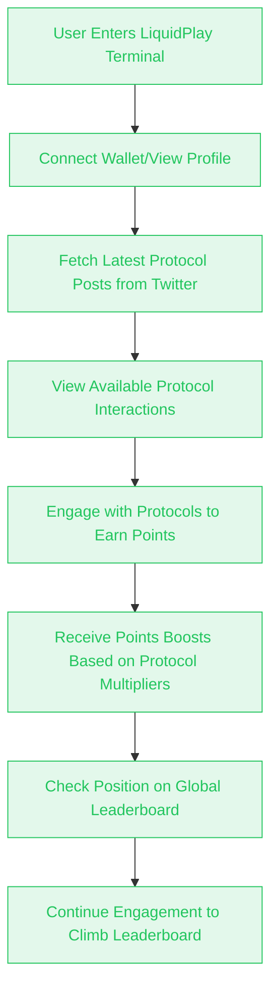
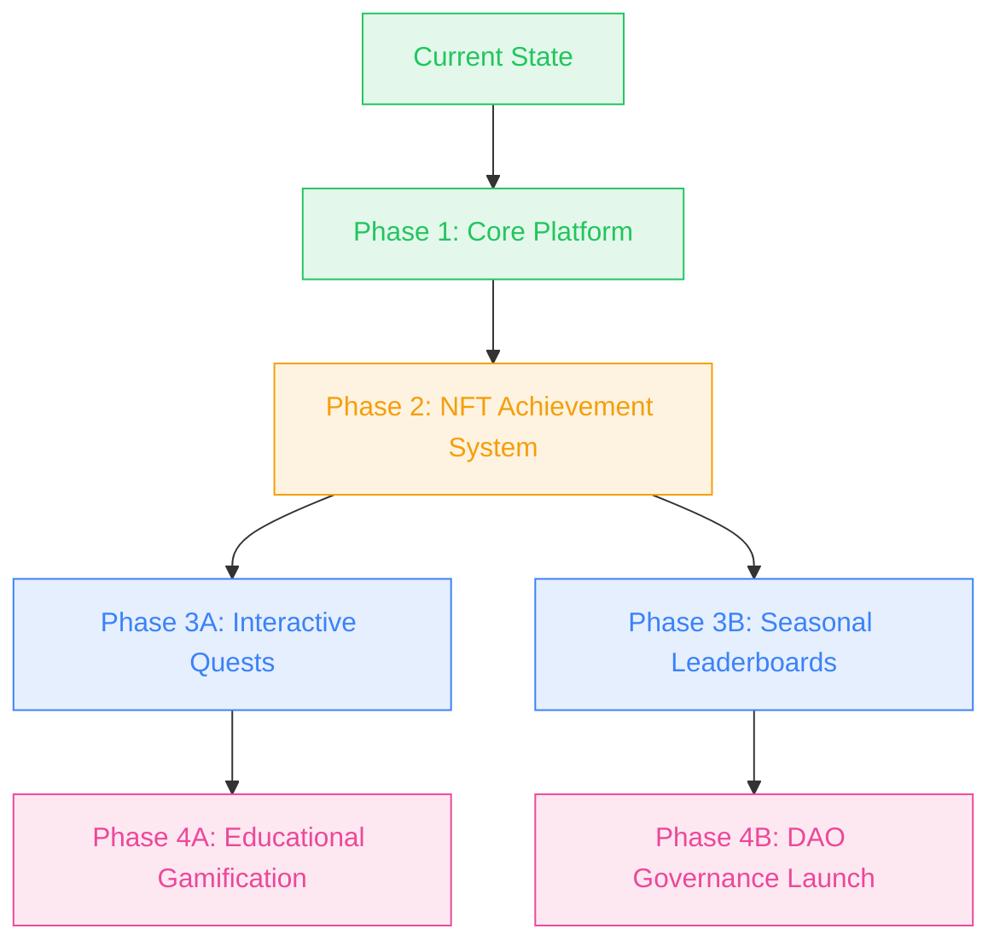

# LiquidPlay

**Gamify your liquidity interactions with our AI terminal.**

## Overview

The LiquidPlay is an open-source project that combines the power of blockchain, social media, and gamification to create a unique user experience. It leverages Twitter to fetch the most recent posts from major Aptos protocols, allowing users to interact with these protocols and earn points based on their engagement.

## Description

LiquidPlay creates a gamified experience for blockchain users. By fetching and analyzing data from Aptos protocols through Twitter, the platform enables users to engage with these protocols directly through the terminal interface. Each interaction is scored and contributes to the user's points, which is tracked on a global leaderboard.

Users can view their profile, check the leaderboard to see where they rank among other players, and see which protocols currently offer XP boosts for interactions.

## User Flow

## Key Features

- **Protocol Interaction Scoring**: Fetches the latest posts from Aptos protocols on Twitter and assigns scores for user interactions.
- **Points Boosts**: Earn points by engaging with blockchain protocols directly through the terminal.
- **Global Leaderboard**: Compete against other users to climb the leaderboard based on your points.
- **Gamification**: Transform liquidity interactions into a game-like experience.

## How It Works

1. **Fetch Protocol Posts**: The terminal retrieves the latest tweets from verified Aptos protocol accounts.
2. **Engage and Earn Points**: Users interact with these protocols to earn scores and points boosts.
3. **Climb the Leaderboard**: Track your progress on the global leaderboard and compete with others in the community.

## Tech Stack

- **Frontend**: Next.js 15, React 19, Tailwind CSS 4
- **Blockchain**: Aptos SDK (@aptos-labs/ts-sdk)
- **UI Framework**: Radix UI components, Assistant UI React
- **Data Handling**: Drizzle ORM, PostgreSQL
- **API Integration**: Twitter client for protocol data
- **AI Features**: AI SDK for OpenAI and Groq integrations
- **Styling**: Tailwind CSS
- **Development**: TypeScript, Bun

## Roadmap

### Upcoming Features

1. **NFT Achievement System**
   - Earn unique NFTs for completing specific protocol interactions
   - Tiered achievement system with rare collectibles
   - Showcase achievements in user profiles

2. **Interactive Quests**
   - Time-limited protocol interaction challenges
   - Multi-step quests requiring various DeFi actions
   - Special rewards for quest completion

3. **Seasonal Leaderboards**
   - Quarterly competitive seasons with reset rankings
   - Season-specific rewards and bonuses
   - Special themes based on Aptos ecosystem developments

4. **Educational Gamification**
   - Learn-to-earn mechanics for DeFi knowledge
   - Interactive tutorials with XP rewards
   - Protocol deep-dives with quiz challenges

5. **DAO Governance Launch**
   - Community voting on future features
   - Protocol multiplier governance
   - Treasury management for platform rewards
