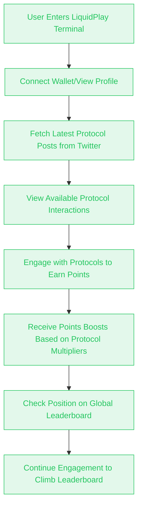
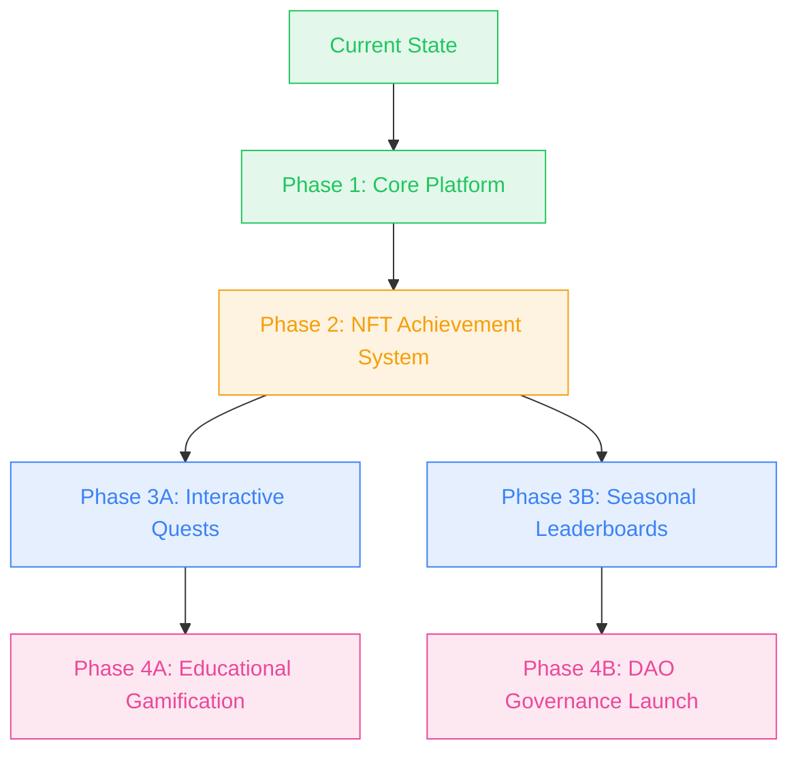
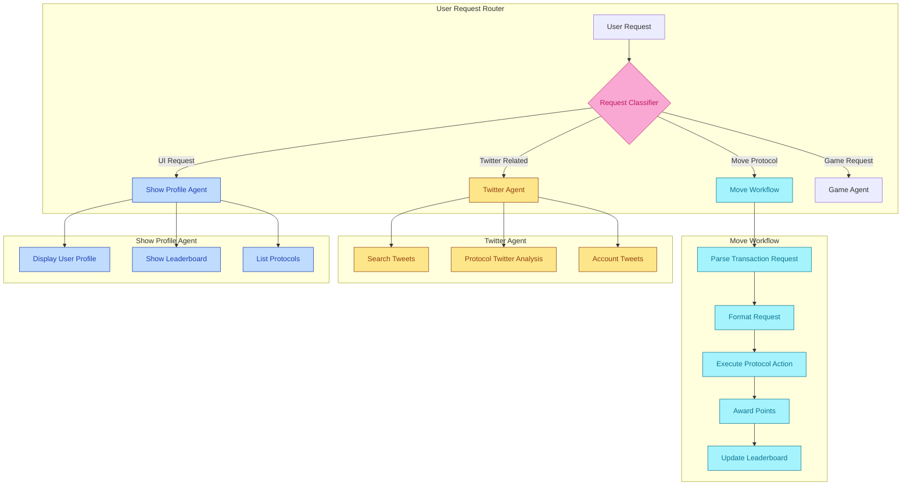

    

# LiquidPlay

**Gamify your liquidity interactions with our AI terminal.**

## Overview

The LiquidPlay is project that combines the power of blockchain, social media, and gamification to create a unique user experience. It leverages Twitter to fetch the most recent posts from major Aptos protocols, allowing users to interact with these protocols and earn XP points based on their engagement.

## Description

LiquidPlay creates a gamified experience for blockchain users. By fetching and analyzing data from Aptos protocols through Twitter, the platform enables users to engage with these protocols directly through the terminal interface. Each interaction is scored and contributes to the user's points, which is tracked on a global leaderboard.

Users can view their profile, check the leaderboard to see where they rank among other players, and see which protocols currently offer XP boosts for interactions.

## Problem

### Complexity of DeFi Interactions
Many users find interacting with DeFi protocols complex and intimidating. LiquidPlay addresses this by:
- Providing a gamified interface that makes DeFi interactions more approachable and engaging
- Offering a unified terminal where users can interact with multiple protocols in one place
- Using AI to simplify and guide users through complex blockchain transactions

### Lack of Engagement and Retention in DeFi
DeFi platforms often struggle to keep users engaged long-term. LiquidPlay tackles this by:
- Implementing a points system and global leaderboard to foster competition and regular engagement
- Offering points boosts for specific protocols, encouraging users to explore different DeFi services
- Planning future features like NFT achievements and seasonal leaderboards to maintain long-term interest

### Information Overload in the Crypto Space
Users often find it challenging to keep up with the latest updates from various protocols. LiquidPlay helps by:
- Aggregating and presenting the most recent and relevant information from major Aptos protocols via their Twitter feeds
- Using AI to analyze and score the relevance of blockchain-related tweets, helping users focus on what's important

### Educational Barriers in DeFi
Many potential users are held back by a lack of knowledge about DeFi concepts. LiquidPlay addresses this through:
- Plans for educational gamification features, including learn-to-earn mechanics and interactive tutorials
- Rewarding users with XP for learning about DeFi concepts and completing educational quests

### Fragmented User Experience Across Protocols
Users typically need to navigate multiple websites and interfaces to interact with different protocols. LiquidPlay solves this by:
- Providing a single terminal interface where users can engage with multiple Aptos protocols
- Streamlining the process of switching between different DeFi activities like staking, lending, and borrowing

### Lack of Immediate Rewards for DeFi Participation
Traditional DeFi often has delayed or complex reward structures. LiquidPlay offers:
- Immediate gratification through points and leaderboard positioning for protocol interactions
- A clear, gamified reward system that motivates continued participation

## User Flow

## Key Features

- **Protocol Interaction Scoring**: Fetches the latest posts from Aptos protocols on Twitter and assigns scores for user interactions.
- **Points Boosts**: Earn points by engaging with blockchain protocols directly through the terminal.
- **Global Leaderboard**: Compete against other users to climb the leaderboard based on your points.
- **Gamification**: Transform liquidity interactions into a game-like experience.

## How It Works

1. **Fetch Protocol Posts**: The terminal retrieves the latest tweets from verified Aptos protocol accounts.
2. **Engage and Earn Points**: Users interact with these protocols to earn scores and points boosts.
3. **Climb the Leaderboard**: Track your progress on the global leaderboard and compete with others in the community.

## Tech Stack

- **Frontend**: Next.js 15, React 19, Tailwind CSS 4
- **Blockchain**: Aptos SDK (@aptos-labs/ts-sdk)
- **UI Framework**: Radix UI components, Assistant UI React
- **Data Handling**: Drizzle ORM, PostgreSQL
- **API Integration**: Twitter client for protocol data
- **AI Features**: AI SDK for OpenAI and Groq integrations
- **Styling**: Tailwind CSS
- **Development**: TypeScript, Bun

## Roadmap

### Upcoming Features

1. **NFT Achievement System**
   - Earn unique NFTs for completing specific protocol interactions
   - Tiered achievement system with rare collectibles
   - Showcase achievements in user profiles

2. **Interactive Quests**
   - Time-limited protocol interaction challenges
   - Multi-step quests requiring various DeFi actions
   - Special rewards for quest completion

3. **Seasonal Leaderboards**
   - Quarterly competitive seasons with reset rankings
   - Season-specific rewards and bonuses
   - Special themes based on Aptos ecosystem developments

4. **Educational Gamification**
   - Learn-to-earn mechanics for DeFi knowledge
   - Interactive tutorials with XP rewards
   - Protocol deep-dives with quiz challenges

5. **DAO Governance Launch**
   - Community voting on future features
   - Protocol multiplier governance
   - Treasury management for platform rewards

## AI Workflows

LiquidPlay uses advanced AI workflows to provide a seamless experience for users. The system is built using Mastra.ai, leveraging specialized agents and workflows to handle different types of requests.

### AI System Architecture

1. **Request Classification**
   - All user requests are first analyzed by a classification model
   - The model determines whether the request is related to Twitter, Move blockchain protocols, UI display, or game features
   - Based on the classification, the request is routed to the appropriate specialized agent

2. **Specialized Agents**
   - **Move Agent**: Handles blockchain interactions with Aptos protocols
     - Staking with Amnis
     - Lending/borrowing with Aries
     - Lending with Joule Finance
     - Wallet balance checks
     - Reward point calculation
   
   - **Twitter Agent**: Manages all Twitter-related requests
     - Fetching tweets from specific accounts
     - Searching topics across Twitter
     - Analyzing protocol-related Twitter activity
     - Scoring relevance of blockchain tweets
   
   - **Show Profile Agent**: Handles UI presentation requests
     - Displaying user profiles
     - Showing global leaderboards
     - Listing available protocols with their multipliers

3. **Transaction Rewards Workflow**
   - When a user performs a blockchain transaction:
     1. The request is parsed and formatted for the target protocol
     2. The transaction is executed on the blockchain
     3. The system calculates reward points based on protocol multipliers
     4. Points are awarded to the user and the leaderboard is updated

This AI-powered system creates a seamless experience where users can interact naturally through the terminal, with the appropriate agent handling each request based on its type and purpose.

## Screenshots

